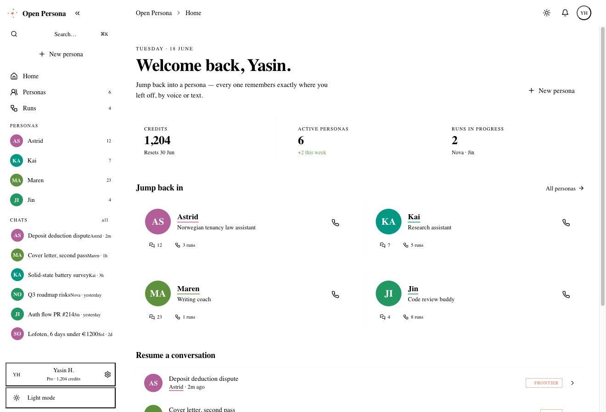

# Open Persona

> Build and run AI personas with **typed memory** and **tier-routed model selection** — across text and real-time voice.



**Open Persona** is an open-core platform for building AI personas that hold a
stable identity across long, multi-turn, tool-using conversations. The engine is
**MIT-licensed**; the hosted application is **source-available** (PolyForm
Noncommercial). Clone it, set one model key, and run the whole product locally —
no infrastructure required.

---

## Why it's different

Most "AI persona" products are a system prompt and a vibe. Open Persona is built
around two ideas that hold up over hundreds of turns:

- **Typed memory.** A persona is a typed YAML document with four separate,
  versioned memory stores — **identity** (who it is), **self_facts** (what it
  knows about itself), **worldview** (what it believes, with epistemic tags), and
  **episodic** (what it remembers). Identity is immutable at runtime; the mutable
  stores are append-only with full `history` and one-call `rollback`. Every write
  carries its source (`system` / `user` / `persona_self`) and emits an audit
  event. Identity isn't free text — it's structured data with per-store update
  policies.

- **Tier-routed model selection.** A rule-based router puts a right-sized model on
  each task: a frontier model where persona quality matters (first turn, identity
  questions, contested topics), a mid model for routine in-character work, and a
  small model for boilerplate (summarisation, classification, query rewriting). No
  trained router, no embeddings, no opacity — rules you can read, with optional
  deterministic cost/quality/latency scoring to pick the best model within a tier.

- **A shared brain across personas.** Beyond each persona's own memory, a
  user-scoped knowledge graph lets every persona draw on what you told the
  *others* — the tutor adapts to a struggle you mentioned to someone else; the
  planner budgets for a move it was never told about directly. Knowledge is used
  *naturally* (applied where relevant, never recited or paraded), held tentatively
  when old, and honestly attributable when you ask how it knows — with wellbeing-
  sensitive matters handled with care. It's additive: a persona with an empty
  graph behaves exactly as before.

Wrap audio I/O around the same turn loop and you get **real-time voice** with the
same persona, memory, and routing — voice is the same stack, not a parallel one.

---

## Architecture

Four layers, each talking only to the one below it, plus a voice trunk that
attaches at the API layer and reuses the same persona / memory / runtime surface.

```
   ┌─────────────────────────────────────────────────────────────────────┐
   │                         Web App (Next.js)                           │
   │    auth · persona authoring · chat UI · voice client                │
   └──────────────────────────────┬──────────────────────────────────────┘
                                  │ HTTPS · SSE · OpenAPI
   ┌──────────────────────────────▼──────────────────────────────────────┐
   │                    Hosted API (FastAPI)                             │
   │  · users · personas · conversations · credits · audit log           │
   │  · /v1/personas/:id/chat   (SSE streaming)                          │       ┌──────────────────────────┐
   │  · /v1/personas/:id/run    (agentic task)                           │◀────▶ │   persona-voice trunk    │
   │  · /v1/personas/author     (LLM-assisted authoring)                 │       │  LiveKit substrate (V1)  │
   │  · /v1/voice/token         (real-time voice session)               │       │  Streaming STT     (V2)  │
   └──────────────────────────────┬──────────────────────────────────────┘       │  Streaming TTS     (V3)  │
                                  │ in-process                                   │  Turn-taking       (V4)  │
   ┌──────────────────────────────▼──────────────────────────────────────┐       │  Reply producer    (V5)  │
   │              persona-runtime (Python)                               │       │  Frontend client   (V6)  │
   │  ┌────────────┐  ┌──────────┐  ┌─────────┐  ┌──────────────────┐    │       └──────────────────────────┘
   │  │ Memory     │  │  Router  │  │ Toolbox │  │ History manager  │    │
   │  │  identity  │  │ frontier │  │  web    │  │ summarise+compact│    │
   │  │  self      │  │ mid      │  │  fs     │  │ skill budgeter   │    │
   │  │  world     │  │ small    │  │  mcp    │  │                  │    │
   │  │  episodic  │  │          │  │  skills │  │                  │    │
   │  └────────────┘  └──────────┘  └─────────┘  └──────────────────┘    │
   │                AgenticLoop (plan → act → reflect)                   │
   └──────────────────────────────┬──────────────────────────────────────┘
                                  │
   ┌──────────────────────────────▼──────────────────────────────────────┐
   │              persona-core (Python library, MIT licensed)            │
   │  · YAML schema · validation · registry                              │
   │  · four typed memory stores (Chroma + Postgres/pgvector)            │
   │  · model backend abstraction (frontier APIs + local HF + Ollama)    │
   │  · tools · skills · MCP · image-gen · sandbox · audit · CLI         │
   └─────────────────────────────────────────────────────────────────────┘
                │                                  │
                ▼                                  ▼
       ┌────────────────────┐          ┌──────────────────────────────┐
       │  Storage           │          │   Model providers            │
       │  community: SQLite │          │   Anthropic · OpenAI ·       │
       │   + Chroma (file)  │          │   DeepSeek · Groq · Together │
       │  cloud: Postgres   │          │   NVIDIA · OpenRouter ·      │
       │   + pgvector + RLS │          │   Ollama · local HF          │
       └────────────────────┘          └──────────────────────────────┘
```

| Layer | Package | What it is | License |
| --- | --- | --- | --- |
| Library | [`packages/core/`](packages/core/README.md) | Persona schema, four typed memory stores, model backends, tools / skills / MCP, image-gen, sandbox, audit, and the `persona` CLI. The `pip install persona-core` foundation. | **MIT** |
| Engine | [`packages/runtime/`](packages/runtime/README.md) | Conversation loop, tier router, prompt builder, history manager, agentic plan-act-reflect loop, tool dispatch, per-turn telemetry. | **MIT** |
| Voice | [`packages/voice/`](packages/voice/README.md) | LiveKit-based real-time voice trunk: streaming STT, streaming TTS, turn-taking + barge-in, persona-conditioned reply producer, unified memory. | **MIT** |
| API | [`packages/api/`](packages/api/) | FastAPI service: persona CRUD, SSE-streaming chat, agentic runs, LLM-assisted authoring, voice token issuance, edition-gated auth / credits / RLS. Plus a Postgres-backed durable **job queue** + a separate long-lived **worker** process for crash-resumable, at-least-once background work. | PolyForm-NC 1.0.0 |
| Web | [`packages/web/`](packages/web/README.md) | Next.js app: persona authoring, chat UI, voice client. | PolyForm-NC 1.0.0 |

The dependency arrow points one way. `persona-core` imports nothing from the
upper layers; the MIT engine never imports the source-available app (enforced in
CI by an `import-linter` contract).

---

## Editions

One config switch, `PERSONA_EDITION`, selects the whole product's posture:

| | **community** (default) | **cloud** |
| --- | --- | --- |
| Use case | Local, single-user, self-hosted | Multi-tenant hosted service |
| Auth | None — a fixed local owner | Clerk JWT |
| Credits | Unlimited (no metering) | Metered |
| Relational store | SQLite (single file) | Postgres + RLS |
| Vector memory | Chroma (local directory) | pgvector |
| Infra to start | A model API key | Postgres, Clerk, object storage |

The community edition is the headline: a fully-functional, zero-infrastructure
self-host for **noncommercial** use. The cloud edition is the same codebase with
the commercial concerns (auth, credits, multi-tenant isolation) switched on.

> **Safety guard:** community has no auth wall by design, so the API refuses to
> start on a non-loopback bind unless you explicitly opt in with
> `PERSONA_ALLOW_PUBLIC_NOAUTH=1`. A public deployment is meant to be `cloud`.

---

## Quick start

### Community edition — clone and run (zero infra)

You only need Python 3.11+, [uv](https://docs.astral.sh/uv/),
[pnpm](https://pnpm.io/), and one model API key. Persistence is a SQLite file plus
a local Chroma directory, both created on first boot. No Docker, no Postgres, no
sign-in wall.

```bash
# 1. clone + install
git clone https://github.com/yasinhessnawi1/Open-Persona.git
cd Open-Persona
uv sync

# 2. set ONE model API key (community needs nothing else)
export PERSONA_PROVIDER=anthropic
export PERSONA_API_KEY=sk-ant-...
export PERSONA_MODEL=claude-sonnet-4-6

# 3. run the API (SQLite + Chroma are created on first boot; a fixed
#    local owner is seeded; PERSONA_EDITION defaults to community)
uv run persona-api            # or:  uv run python -m persona_api
#    loads .env as-is; override bind with PERSONA_API_HOST / PERSONA_API_PORT

# 4. run the web app (the community build is Clerk-free)
cd packages/web && pnpm install && pnpm dev
```

> **No key yet? It still boots.** The model API key is needed only for the
> model-driven features (chat, persona authoring, agentic runs). Without one the API
> comes up cleanly and persona browsing / creation works; the model-driven endpoints
> return a clean `503 model_unavailable` ("set a model key") rather than an error —
> so you can explore first and add the key when you want to talk to a persona.

Prefer the terminal? The MIT library ships a CLI — no API or web app required:

```bash
uv run persona init                                       # interactive → a persona.yaml
uv run persona chat packages/core/examples/astrid_tenancy_law.yaml
```

### Cloud edition — the owner's commercial hosting

`PERSONA_EDITION=cloud` reproduces the hosted behavior: Clerk auth, multi-tenant
Postgres RLS, and metered credits. It needs `DATABASE_URL` / `APP_DATABASE_URL`,
the Clerk/JWT vars, and `docker compose up -d postgres`. Both the API process and
the web build must set `PERSONA_EDITION=cloud`.

### Developing / testing

```bash
docker compose up -d postgres          # for the hosted-path integration tests
uv run pytest                          # default suite (integration + external skip)
uv run pytest -m integration           # integration suite (needs Postgres)
uv run mypy packages/core/src --strict # type-check the engine
uv run ruff check                      # lint
uv run lint-imports                    # the MIT-engine ↛ PolyForm-app boundary
cd packages/web && pnpm check:clerk-free   # the community bundle stays Clerk-free
```

To verify the tree is green the way CI sees it (same tools, flags, order) before
you push or after a merge, run the CI mirror:

```bash
./scripts/ci-local.sh                  # full: lint + types + unit + integration + web
./scripts/ci-local.sh --fast           # quick: lint + types + collect-only + unit (defers integration + web)
./scripts/ci-local.sh --no-integration # skip the Postgres leg (loudly reported)
```

Integration runs against a disposable `persona_test` DB on `:5436` (never the dev
`persona` DB — the fixtures `DROP SCHEMA`). Install it as an opt-in pre-push hook:

```bash
ln -sf ../../scripts/pre-push.hook .git/hooks/pre-push   # runs --fast on push; bypass with `git push --no-verify`
```

For all environment variables (provider keys, Postgres URLs, voice credentials,
feature toggles), copy `.env.example` to `.env` and fill in what you need — each
section is grouped by package with the minimum set documented.

---

## Status

**v1 — the four-layer text platform (`core` + `runtime` + `api` + `web`) is usable
end-to-end**, and the voice trunk is live through persona-conditioned generation
with unified memory.

- **`persona-core`** — typed memory stores with versioned `history` / `rollback`,
  YAML schema + validator, multi-provider model backends, tools + skills + MCP
  (built-in servers included), image generation, a sandboxed code-execution
  protocol, the `persona` CLI, and an audit log. **Shipped.**
- **`persona-runtime`** — conversation loop, prompt builder with skill-token
  budgeting, summarise-and-compact history manager, tier router with
  multi-model-per-tier cross-provider fallback, optional deterministic intelligent
  routing, agentic plan-act-reflect loop. **Shipped.**
- **`persona-api`** — FastAPI service with edition-gated auth/credits/RLS, persona
  CRUD, SSE-streaming chat, agentic runs, LLM-assisted authoring, voice token
  issuance. **Shipped.**
- **`persona-web`** — Next.js app with persona authoring, chat UI, and the voice
  client. **Shipped** (a UI redesign is in flight).
- **`persona-voice`** — LiveKit substrate, streaming STT, streaming TTS,
  turn-taking + barge-in, and the persona-conditioned reply producer writing voice
  turns to the same episodic store as text. The frontend voice client is the
  remaining piece.
- **`persona-connectors`** — the framework that makes a persona reachable on
  messaging platforms, plus the **chat-app adapters: Telegram, Discord, Slack**.
  Link your account from the web (Telegram via a deep link, Discord/Slack via
  OAuth), then DM your persona by name — switching personas, `/new`, and idle
  boundaries all work over a real chat, with ownership isolated exactly as on the
  web. Deliberately thin: each adapter is its platform's glue, the framework does
  the rest. **Telegram, Discord & Slack shipped** (DM surfaces); WhatsApp/SMS/email
  follow.

See the [CHANGELOG](CHANGELOG.md) and each package's `CHANGELOG.md` for the
per-surface history.

---

## License

Open Persona is **open-core** — a permissively-licensed engine plus a
source-available application. There is no single repo-wide license; each package
declares its own (an SPDX expression in its `pyproject.toml` / `package.json`,
with a `LICENSE` file alongside).

**Engine — MIT (true OSI open source):** `packages/core/`, `packages/runtime/`,
and `packages/voice/` are licensed under the
[MIT License](https://opensource.org/license/mit). Free for **any** use, including
commercial.

**Application — PolyForm Noncommercial 1.0.0 (source-available, NOT OSI open
source):** `packages/api/` and `packages/web/` are licensed under
[PolyForm Noncommercial 1.0.0](https://polyformproject.org/licenses/noncommercial/1.0.0).
The source is public — you may read, modify, and self-host it for personal,
research, evaluation, educational, and **noncommercial** use — but **commercial
use requires a separate license** from the rights holder.

| Package | SPDX |
| --- | --- |
| `persona-core`, `persona-runtime`, `persona-voice` | `MIT` |
| `persona-api`, `persona-web` | `PolyForm-Noncommercial-1.0.0` |

The MIT engine never imports the PolyForm-NC app (enforced in CI), so the
permissive packages stay genuinely permissive.

---

## Contributing

Contributions are welcome on the three MIT engine packages (`core`, `runtime`,
`voice`) under the MIT License. Please:

1. Open an issue first if the change is non-trivial — a quick design check saves a
   round-trip.
2. Follow the existing engineering style: Python 3.11+, Pydantic v2 frozen models
   on every boundary, `mypy --strict` on `persona-core`, full docstrings on public
   APIs, `ruff check` + `ruff format` clean, and tests for new behaviour.
3. Use conventional commits (`feat:`, `fix:`, `refactor:`, `docs:`, `test:`,
   `chore:`) and squash-merge to `main`.

See the root `pyproject.toml` for the canonical tooling configuration.
`persona-api` and `persona-web` are not accepting external contributions yet —
they're under active hardening and the surface is still moving.
